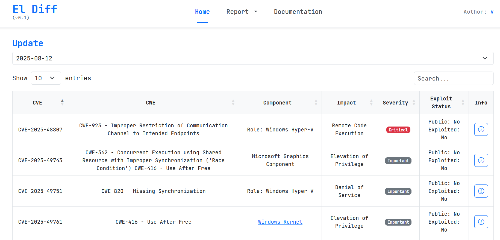
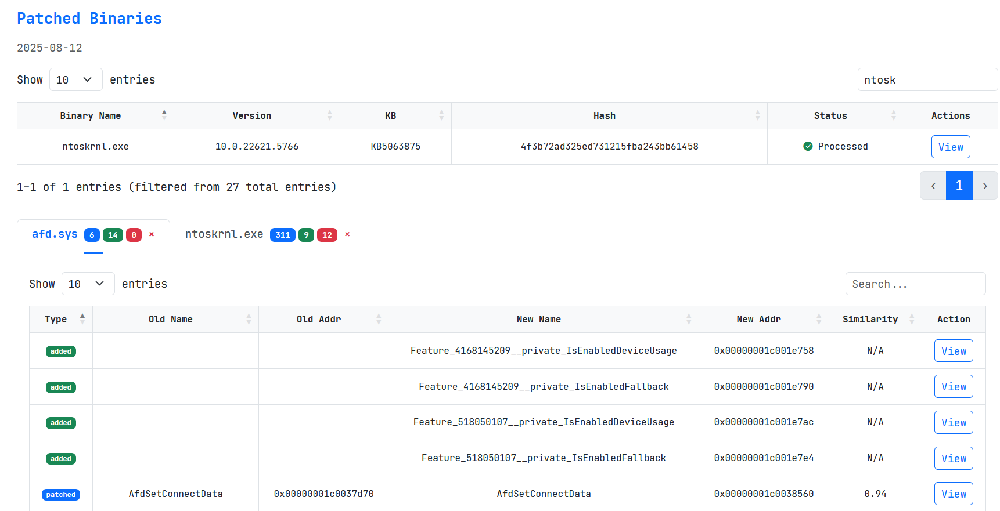
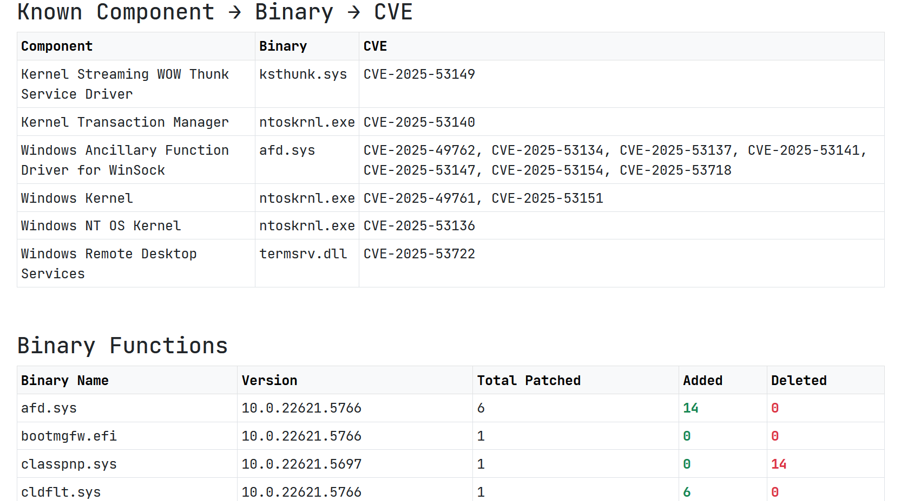

# El Diff -  Automated Windows Patch Analysis Tool

The details were discussed on the DamageLib forum in the topic [The concept of automating diffs for Windows OS](http://damaga377vyvydeqeuigxvl6g5sbmipoxb5nne6gpj3sisbnslbhvrqd.onion/forum/threads/73/)

## UI Example

_Pic 1 - Main window with vulnerabilities info_

_Pic 2 - Patched binaries table with added/deleted/patched functions table_

_Pic 3 - Part of the simple html report with mapped vulnerabilities_

